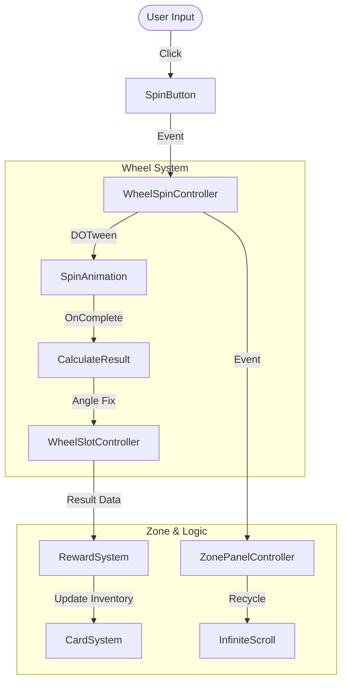
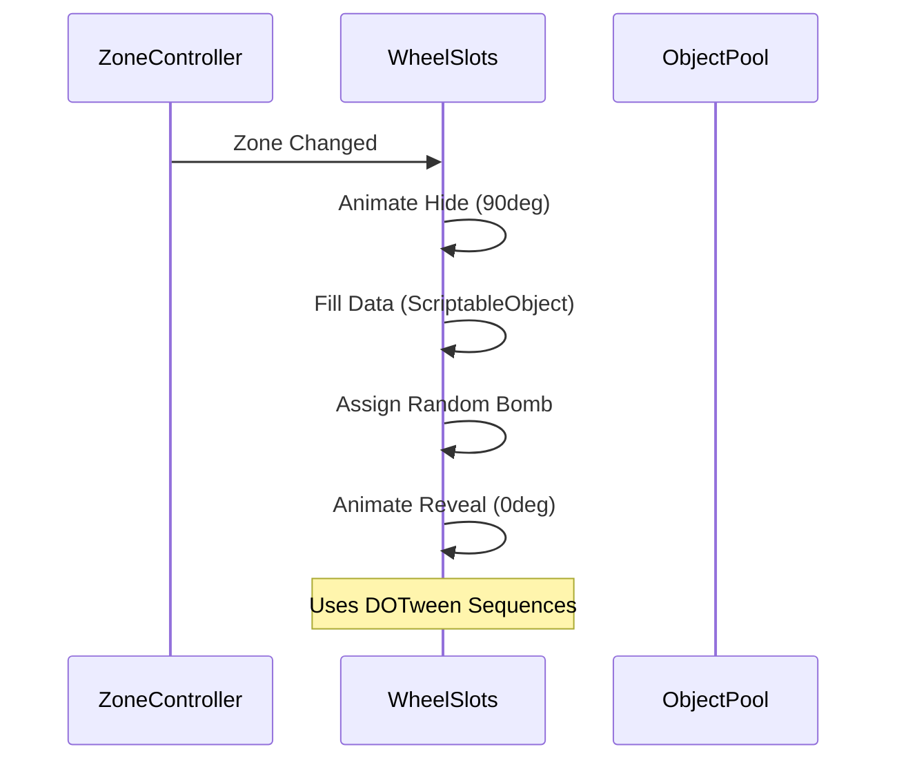

# 🎡 Critical Strike Wheel Game Clone


A high-fidelity clone of the "Critical Strike" wheel mini-game. This project demonstrates advanced Unity UI mechanics, infinite scrolling systems, object pooling, and asynchronous architectures.

## 🎮 Playable Demo
👉 **[Play on Itch.io](https://omerozerf.itch.io/wheel-of-fortune)**

---

## 📸 Visual Showcase

### Gameplay Preview
| Mechanic | Visual |
|:---:|:---:|
| **Core Loop** |  |

### Screen Gallery
| In-Game | Rewards | Exit |
|:---:|:---:|:---:|
|  |  |  |

> **Note**: UI is responsive and tested on 16:9, 20:9, and 4:3 aspect ratios.

---

## 🏗 System Architecture

The project utilizes an event-driven architecture to decouple the UI, Logic, and Data layers.

### Core Loop Flow


### Async Slot Management
The `WheelSlotController` uses `UniTask` to handle the complex state transitions of the wheel slots:



---

## 🚀 Technical Deep Dive

### 1. Advanced Wheel Physics
- **Controller**: `WheelSpinController.cs`
- **Logic**: Uses `DOTween` with `Ease.OutQuart` for a realistic deceleration effect.
- **Precision**: Implements a "Fix Target Angle" post-spin correction to ensure the wheel always snaps perfectly to the center of a slice, calculating the nearest index based on normalized Z updates.

### 2. Infinite Zone Scrolling
- **Controller**: `ZonePanelController.cs`
- **Recycling Logic**: Zones are not destroyed. Instead, when a zone moves off-screen to the left (`_leftRecycleX`), it is repositioned to the far right and updated with new data using `ZoneCreator`.
- **Math**: `zonePower = zoneIndex * powerMultiplier` drives the difficulty curve.

### 3. Asynchronous UI & Pooling
- **Inventory**: `CardPanelController` manages the fly-to-bag animations. It waits for the visual effect to complete before updating the data model, ensuring visual consistency.
- **Performance**: `ObjectPoolManagerUI` handles all particle effects and temporary UI elements, preventing GC spikes during the spin cycle.

### 4. Smart Bomb Logic
- **Constraint Handling**: Bombs are injected dynamically into the wheel.
- **Rules**:
  - `Safe Zone`: No bombs.
  - `Super Zone`: No bombs, high reward multiplier.
  - `Normal Zone`: 1 Bomb injected into a non-winning slot.
  - **Override**: If a slice has `allowedSlots` config (e.g., specific rewards only), the bomb logic respects it.

---

## 📂 Project Structure

```text
Assets/_Scripts/
├── Managers/           # Core Game Loop (FPS, Global Vars)
├── WheelSystem/        # Rotational Logic & Slot Management
│   ├── WheelSpinController.cs    # Physics & Input
│   └── WheelSlotController.cs    # Data & Visual State
├── ZoneSystem/         # Infinite Scrolling & Difficulty
├── CardSystem/         # Inventory & Visual Feedback
├── ObjectPoolSystem/   # Performance Optimization
└── Editor/
    └── AutoSpriteAtlas.cs  # Custom Tooling
```

---

## 🛠 Editor Tools

The project includes custom editor tools to streamline the workflow.

- **Auto Sprite Atlas**: Located at `Tools/Vertigo UI/...`. Automatically creates and updates Sprite Atlases from folder contents, ensuring consistent compression and draw call optimization.

---

## 💻 Installation & Requirements

- **Engine**: Unity 2022.3.x or later.
- **Dependencies**:
  - `DOTween` (Animation)
  - `UniTask` (Async/Await support)
  - `TextMeshPro` (UI)

### Build Instructions
1. Switch platform to **Android**.
2. Ensure Scenes in Build has `_Scenes/Game`.
3. Build APK.

---

## 🔗 Links & Resources

- **Gameplay Folder**: [Google Drive](https://drive.google.com/drive/folders/1vAjKEF8tkwy2UwZllpBJsYHQo_hDQJl1?usp=sharing)
